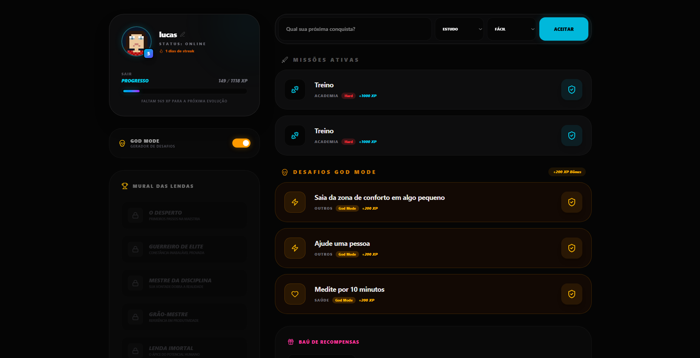
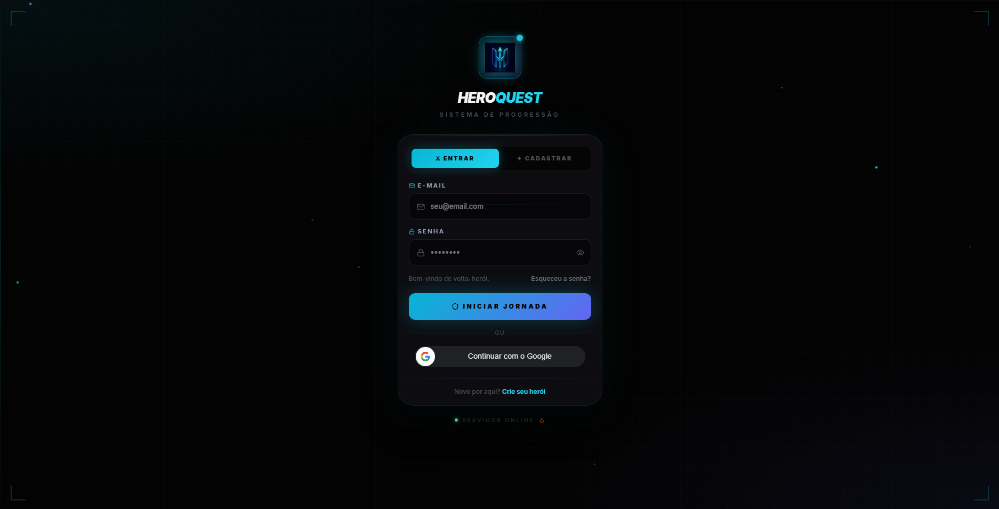
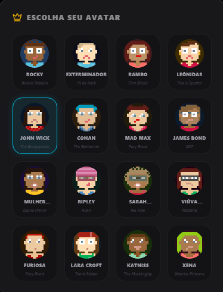

# 🛡️ Hero Mode

**A gamification engine that turns everyday tasks into an RPG progression system.**
Log a workout, finish a study session, ship some code — each one is a Quest that grants XP, gold, and attribute points toward a character that reflects what you actually did that week.

🔗 **Live:** [heromode.com.br](https://heromode.com.br)


---

## 📸 Screenshots

| Home | Sign in with Google |
|---|---|
|  |  |
| The landing view users hit first. | OAuth login — the ID token is verified server-side, not trusted from the client. |

| Hero Profile | Level Up |
|---|---|
|  |  |
| Character sheet: attributes, current tier, and streak state. | Level-up feedback, animated with Framer Motion. |

---

## ✅ What works today

- **Authentication** — email/password with JWT, plus **Sign in with Google** (OAuth ID token verified server-side against the Google Cloud client ID)
- **Quests** — create, complete, and track daily/weekly challenges that award XP and gold
- **Attributes** — Strength, Intelligence, Agility and Focus, each advanced by the quest category that maps to it
- **Leveling** — XP thresholds that unlock tiers and titles
- **Daily streaks** — consecutive-day tracking with a "Berserker" multiplier on sustained streaks
- **Deployed** — running in production at [heromode.com.br](https://heromode.com.br), containerized with a multi-stage Docker build

---

## 🛠️ Tech Stack

### Backend
| | |
|---|---|
| Language | Java 21 |
| Framework | Spring Boot 3.4 |
| Security | Spring Security + JJWT 0.12 (HS256), Google API Client for OAuth ID token verification |
| Persistence | Spring Data JPA / Hibernate |
| Database | MySQL 8.0 |
| Build | Maven (wrapper included) |

### Frontend
| | |
|---|---|
| Framework | React 19 + Vite 7 |
| Styling | Tailwind CSS 4 |
| Animation | Framer Motion |
| Icons | Lucide React |
| HTTP | Axios |
| Auth | `@react-oauth/google` |
| Linting | ESLint 9 (flat config) with react-hooks + react-refresh |

### Infrastructure
- Multi-stage `Dockerfile` — Maven/Temurin 21 build stage, slim JRE runtime stage
- `compose.yaml` — MySQL 8.0 + phpMyAdmin for local development
- All secrets injected via environment variables (no credentials in source)

---


### Project layout

```
HeroMode/
├── src/main/java/          # Spring Boot application
├── src/main/resources/     # application.properties, config
├── lifexp/                 # React + Vite frontend
├── assets/                 # screenshots used in this README
├── data/                   # [PREENCHER: o que vive aqui?]
├── Dockerfile              # multi-stage build
└── compose.yaml            # MySQL + phpMyAdmin (dev)
```

---

## 🚀 Getting Started

### Prerequisites
- JDK 21+
- Node.js 20+
- Docker & Docker Compose

### 1. Start the database

```bash
docker compose up -d
```

MySQL will be available on `localhost:3306` and phpMyAdmin on `localhost:8081`.

### 2. Configure the backend

Create a `.env` file (or export the variables in your shell):

```bash
SPRING_DATASOURCE_URL=jdbc:mysql://localhost:3306/heromode
SPRING_DATASOURCE_USERNAME=heromode
SPRING_DATASOURCE_PASSWORD=heromode
JWT_SECRET=<a base64 secret of at least 256 bits>
GOOGLE_CLIENT_ID=<your OAuth client ID from Google Cloud Console>
```

### 3. Run the backend

```bash
./mvnw spring-boot:run
```

The API starts on `http://localhost:8080`.

### 4. Run the frontend

```bash
cd lifexp
npm install
npm run dev
```

The app starts on `http://localhost:5173`.

### Running with Docker

```bash
docker build -t heromode .
docker run -p 8080:8080 --env-file .env heromode
```

---

## 🗺️ Roadmap

- [ ] **Test suite** — unit coverage on the XP/streak domain logic, integration tests on the auth flow
- [ ] **Flyway migrations** — replace Hibernate `ddl-auto` with versioned, reviewable schema changes
- [ ] **CI pipeline** — GitHub Actions running build + tests on every push
- [ ] **Real-time notifications** — WebSocket quest alerts
- [ ] **Boss Battles** — high-difficulty challenges with scaled rewards
- [ ] **Party System** — shared objectives across multiple heroes
- [ ] **Google Calendar sync** — automatic quest creation from scheduled events

---

## 👥 Contributors

- **Lucas Fogaça de Aguiar** — Technology Manager
- **Victor Matheus Seifert** — Innovation Manager

